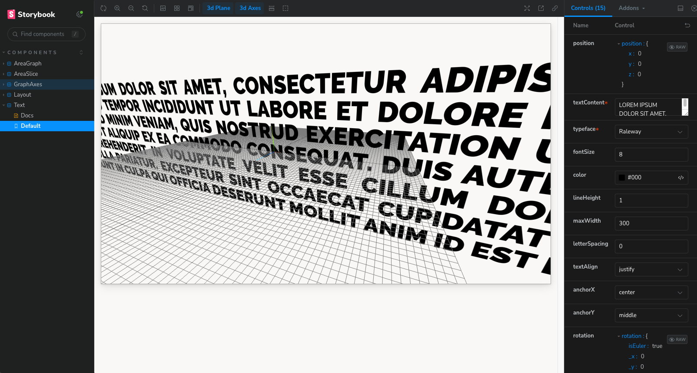
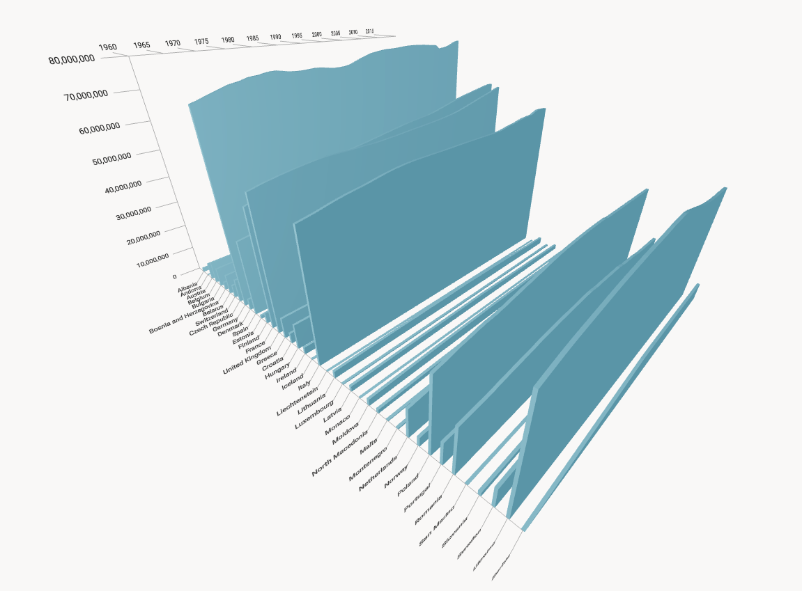

# **_Population Graph Series_**

A small experiment rendering population change over time for European countries as a 3d series. CSV data is loaded and prepared using `danfa.js` and then rendered as objects using the `React Three Fiber` wrapper around `THREEjs`. Prototyping of the individual scene components was done in `Storybook`.

The result is not immensely practical, but was interesting as an exploration of how data can be displayed on three axes.

## **_Future Features_**

- Add test coverage. Testing of the scene graph should be easier with the help of `@react-three/test-renderer`.
- Use `bezierTo` rather than `lineTo` for a smoother visual change over time?
- Explore if colour could enhance meaning, eg. could population density be a spectrum over the `y` axis?
- One of the biggest problems is that it is hard to read the data. Consider adding interaction states that allow 1). visually highlighting a country and 2). overlaying a projection of marker lines in the graph's bounding box.
